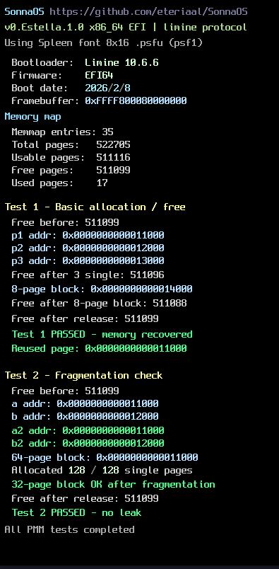

# SonnaOS
Writing an operating system because I want to occupy my time...  

## Kernel
**Estella** - x86_64 EFI kernel using the Limine bootloader protocol.

### Current status
- Boots via Limine
- GDT + TSS
- IDT + exception handling
- Simple bitmap PMM with alloc/free tests
- Framebuffer console (Spleen 8x16 PSF1 font)
- Debug output: boot info, memory map, PMM tests

Next:
- IRQ handling
- PSF2 font support
- Serial console for better debugging
- Paging + virtual memory + kernel heap  

---

---

### Requirements
- clang + ld.lld
- QEMU + OVMF
- make, git, curl/wget

### build & run
```bash
make run
```